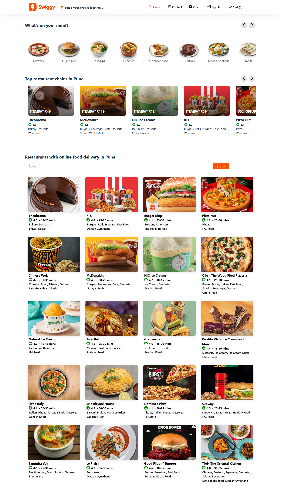
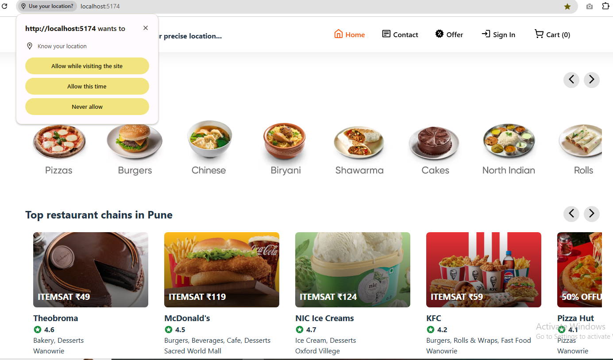
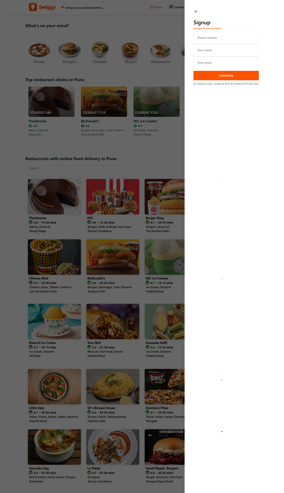
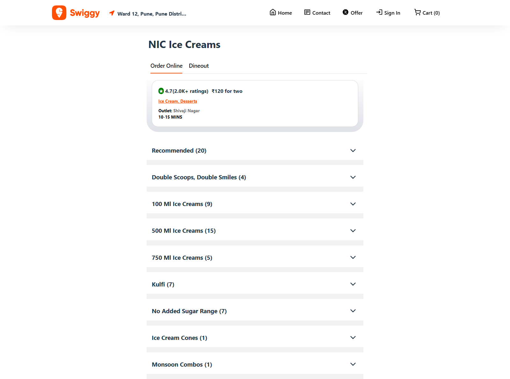
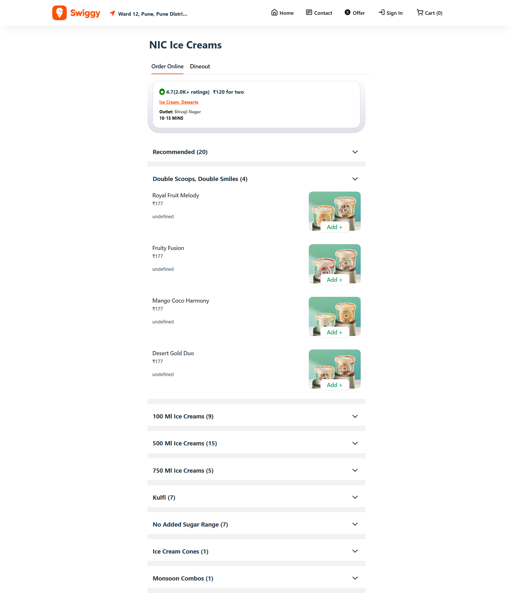
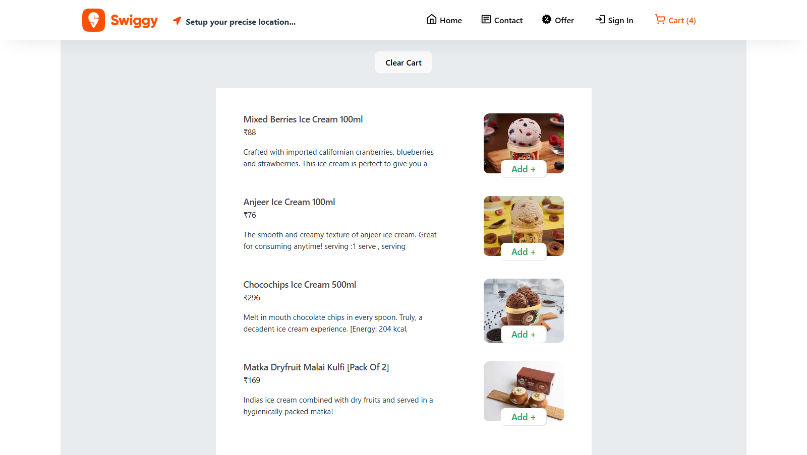

# 🍔 Swiggy Clone (React + Vite)

A responsive food delivery app clone inspired by Swiggy. Built using **React**, **Vite**, **Redux Toolkit**, and modern development practices.

## 🔗 Live Demo

👉 [Click here to view live](https://prachivandre.github.io/swiggyClone/)

---

## 🚀 Features

- 🔍 Browse restaurants and menus
- 🍔 Add items to cart
- 🛒 Cart management with Redux Toolkit
- 🧭 Client-side routing using React Router
- 📦 Component-based reusable architecture
- ⚡️ Fast performance with Vite

## 🏠 Home Page


## Users Current Location:


## Signup/Login form


## Add Item Page




## Add to Cart page


## 🛠 Tech Stack

| Tech | Description |
|------|-------------|
| React | UI Library |
| Vite | Lightning-fast bundler |
| Redux Toolkit | Global state management |
| React Router | Routing |
| Tailwind / CSS | Styling |
| GitHub Pages | Deployment |

---

## 📁 Folder Structure

```bash
swiggyClone/
├── public/
├── src/
│   ├── components/
│   ├── pages/
│   ├── redux/
│   ├── utils/
│   ├── App.jsx
│   └── main.jsx
├── vite.config.js
└── package.json
